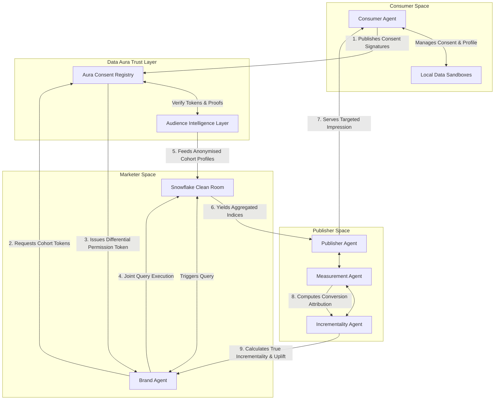

# Data Aura — ARTF-Compliant Consent & Intelligence Layer

Data Aura serves as the trust, identity, and intelligence operating system for the emerging agentic economy. It conforms to the IAB Tech Lab **Agentic Advertising Requirements Task Force (ARTF)** and **Agentic Advertising Message Protocol (AAMP)** specifications, allowing consumers to control, audit, and monetise their data assets while brands access privacy-safe, aggregated customer intelligence.

---

## 🚀 Core Product Vision
1. **Consumer Autonomy First**: Consumers own their data in localized, sandboxed profiles. They can toggle permissions by category or brand, and audit accesses in real time.
2. **Double-Blind Clean Rooms**: Marketers never see PII. Joint analytics computations occur inside isolated clean rooms (e.g. Snowflake Native Apps) and output only aggregated parameters.
3. **Agentic Negotiation**: Independent AI Agents (representing consumers, brands, publishers, and retailers) communicate through standardized interfaces, negotiating value exchanges and campaign delivery automatically.

---

## 🛠 Platform Architecture

Data Aura is built around containerized agent services communicating over standardized AAMP interfaces. Below is the data flow and execution sequence for a typical ad campaign activation:



### 1. Consumer Agent
- **Responsibilities**: Manage consent toggles, negotiate value exchange rewards, protect precise data nodes, and enforce GDPR deletion protocols.
- **Outputs**: Signed consent records, active segment tokens, and reward withdrawal queries.

### 2. Brand Agent
- **Responsibilities**: Discover lookalike cohorts, request permission keys, declare campaign matching parameters, and pay out wallet rewards.
- **Outputs**: Campaign execution queries, budget models, and compliance checklist certifications.

### 3. Data Aura Trust Layer
- **Responsibilities**: Act as double-blind gateway. Verify cryptographic permission signatures, inject differential privacy noise, and log all queries to the ledger.
- **Outputs**: Active permission tokens and audit logs.

### 4. Publisher Agent
- **Responsibilities**: Match publisher inventory with user intent tokens, coordinate delivery, and enforce frequency caps.
- **Outputs**: Reach forecasts and yield curves.

---

## 💻 Tech Stack & Setup

The Data Aura MVP is built as a highly responsive dashboard using:
- **Core UI**: React (Vite 5 Bundler) + TypeScript
- **Styling**: Tailwind CSS v3 (Premium Dark-Theme Design System)
- **Data Visualisation**: Recharts (Interactive Conversion Lift, Category Affinities, and MMM SAT Curves)
- **Icons**: Lucide React

### Running Locally
To launch the developer hot-reloading server:
```bash
npm install
npm run dev
```

To compile a production bundle (verifying TypeScript typings and tree-shaking):
```bash
npm run build
```

---

## 📈 Future Integrations Roadmap

### 1. Snowflake Native Clean Rooms
- **Objective**: Replace the current SQL mockup console with active Snowflake Secure Share tables.
- **Mechanism**: Build custom SQL UDFs inside Snowflake that cross-reference brand tables against Data Aura's encrypted identity hash tables.

### 2. Plaid & Identity Resolution
- **Objective**: Automate the connected bank feed.
- **Mechanism**: Bind Plaid API access tokens to pull anonymized merchant category spend data, refreshing the user's cohort indexes in the sandboxed database.

### 3. IAB Tech Lab AAMP Protocol Adapter
- **Objective**: Achieve network compatibility with third-party agents.
- **Mechanism**: Expose REST endpoints conforming to standard AAMP schemas (`/audience/request`, `/consent/verify`, `/incentive/payout`), enabling Brand Agents on other platforms to query the Data Aura trust registry.
